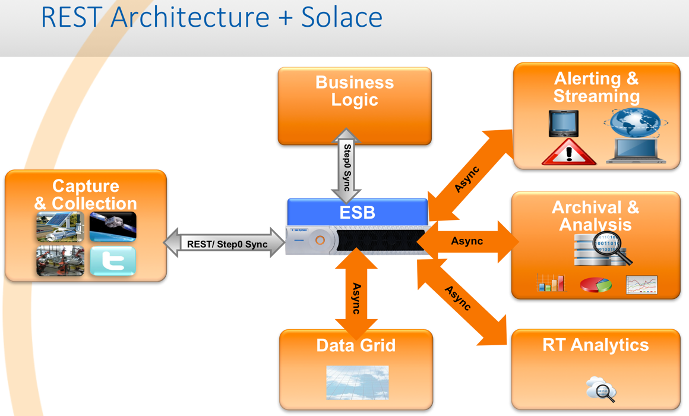

# Insurance Demo
<a href="https://sftp.solacesystems.com/Portal_Docs/#page/REST_Messaging_Protocol_Guide/About_This_Document.html" target="_blank">Using Solace REST Capabilities</a>

## Demo Introduction
> The purpose of this demo is to demonstrate how modern responsive insurance agent applications can be build to communicate directly to high performance Solace messaging system. Thus avoiding legacy way of communicating via web servers in the middle, which becomes a bottleneck by communicating synchronously to slow backend processing systems.

>By having Solace in the middle of a mobile apps and slow backend systems, Solace decouples and stabilizes backend systems (especially under huge volume) and trickle feed at the rate downstream systems can process and respond. Since there is no webserver in the middle for request and response, with minimal payload the responses are very fast. Solace has the capability to terminate 200,000 streaming web client connection.

> This demo typically shows how insurance agents can use iPad/Mobile applications on the fields for Customer Account Opening, Claims Filing and crosssell & upsell. Solace also underpins the ESB (Camel based) and feeds the Hadoop big data storage (not a part of the demo).The purpose of this demo is also to highlight challenges/limitations of typical/legacy REST based applications and to demonstrate Solace capability to allow browser/phone based applications to connect directly to Solace messaging routers and do streaming REST based request/reply messaging.

> 

## Demo Technical Details
### Solace features being used:
>- Native REST support
- Shock absorber
- Throttling
- Fan Out
- High Throughput

### Challenges/Limitations with Typical REST
>

>

### Solace + REST Assured/Benefits
>

### Technologies/Infrastructure Used
>- Solace VMR running on AWS
- NGinx running on AWS for reverse proxy balancer and to handle the CORS issue.
- MySQL DB running on AWS
- HTML5
- REST
- Java based app running in Fuse (ESB) on AWS

## Live Demo
<a href="http://52.74.193.178/insurance" target="_blank">Take me to the demo now</a>

## Demo Walkthrough
>- Open index.html in browser of your choice & Login.  

>The default username is "sumeet" and password is "sumeet". Clicking on "Log Me In To My Account" will take you to "New Applications" page. In the background when you click on Login button, it send a message to Solace appliance which is processed and authenticated by the LoginHandler service.

- New application  
>The below screen takes you to the default landing page that you see after you are successfully authenticated by LoginService handler.
>

>After you fill in the necessary details and choose required images to upload, click on the "Save Application" button. In the background this action will send several messages such as Application Data and Images data. These messages are received the application running within Fuse. The application validates, process and saves Application Data in the DB and images data on the disk (image files names are saved in the DB). It then sends the response back to the UI.

- Search existing applications  
>The below screen shows the search applications page.
>

>You have an option to search applications based on the first name of the applicants. You can leave this space blank and hit the search button to search all existing applications.

>The search response is listed below. You may click the individual record in the list to view/update.

- Update application  
>The below screen shows the edit/update application page.
> 

>You may change any details as needed (including images) and hit "Update Application button". The backend application validates, process and saves the updated Application Data in the DB and images data on the disk (image files names are saved in the DB). It then sends the response back to the UI.

## Download, Install & Run this demo on my machine
1. <a href="http://dev.solacesystems.com/downloads/" target="_blank">Download VMR (Virtual Message Router) & its Release Notes</a>
2. Install and run VMR as per the instructions in the release notes.
3. Create VPN (Partition) in Solace VMR
   <a href="./SolaceConfig.zip" target="_blank">Download CLI Script for VPN creation</a>
   import this script in VMR as described below.
4. <a href="http://dev.mysql.com/downloads/mysql/" target="_blank">Download, install and run MySQL server</a>
5. Download and deploy the DB script.
6. <a href="http://www.jboss.org/products/fuse/download/" target="_blank">Download Fuse</a>
7. [Download the Fuse App]().
8. Update configuration to point to VMR IP address
9. Deploy Fuse App under Fuse deploy folder
10. Start Fuse
11. [Download web application](#).
